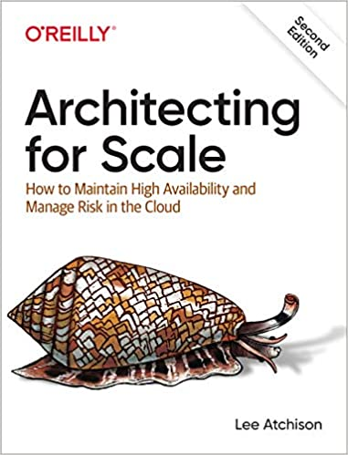
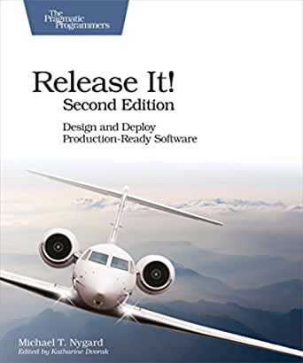

# AWS Summit São Paulo 2022
## Session ARC201 - Resilience Journey on AWS

## Amazon Builders' Library
* [Implementing health checks](https://aws.amazon.com/builders-library/implementing-health-checks/)
* [Static stability using Availability Zones](https://aws.amazon.com/builders-library/static-stability-using-availability-zones/)
* [Workload isolation using shuffle-sharding](https://aws.amazon.com/builders-library/workload-isolation-using-shuffle-sharding/)

See more articles from The Amazon Builders' Library [here](https://aws.amazon.com/builders-library/)

## Blog Posts
* [Building Resilient Well-Architected Workloads Using AWS Resilience Hub](https://aws.amazon.com/blogs/architecture/building-resilient-well-architected-workloads-using-aws-resilience-hub/)
* [Creating a Multi-Region Application with AWS Services - Series](https://aws.amazon.com/blogs/architecture/creating-a-multi-region-application-with-aws-services-part-1-compute-and-security/)
* [Disaster Recovery(DR) Architecture on AWS - Series](https://aws.amazon.com/blogs/architecture/disaster-recovery-dr-architecture-on-aws-part-i-strategies-for-recovery-in-the-cloud/)

See more AWS Blog posts [here](https://aws.amazon.com/blogs/)

## Books

&nbsp; &nbsp; &nbsp; [Architecting for Scale - Lee Atchison](https://www.amazon.com/Architecting-Scale-Maintain-Availability-Manage/dp/1492057177/)

&nbsp; &nbsp; &nbsp; Every day, companies struggle to scale critical applications. As traffic volume and data demands increase, these applications become more complicated and brittle, exposing risks and compromising availability. With the popularity of software as a service, scaling has never been more important.

 
 
 

&nbsp; &nbsp; &nbsp; [Release It! - Michael T. Nygard](https://www.amazon.com/Release-Design-Deploy-Production-Ready-Software/dp/1680502395/)

&nbsp; &nbsp; &nbsp; A single dramatic software failure can cost a company millions of dollars - but can be avoided with simple changes to design and architecture. This is a must-have pragmatic guide to engineering for production systems.

 
 
 

## Presentations
* [Amazon's approach to building resilient services](https://www.youtube.com/watch?v=KLxwhsJuZ44)
* [Amazon's approach to failing successfully](https://www.youtube.com/watch?v=yQiRli2ZPxU)
* [Amazon's approach to high-availability deployment](https://youtube.com/watch?v=bCgD2bX1LI4)
* [Beyond five 9s: Lessons from highest available data planes](https://www.youtube.com/watch?v=2L1S0zfnIzo)

## Whitepapers

* [AWS Well-Architected - Reliability Pillar](https://docs.aws.amazon.com/wellarchitected/latest/reliability-pillar/welcome.html)
* [AWS Prescriptive Guidance - Backup and Recovery approaches on AWS](https://docs.aws.amazon.com/prescriptive-guidance/latest/backup-recovery/backup-recovery.pdf)
* [Building Mission-Critical Financial Services Applications on AWS](https://d1.awsstatic.com/Industries/Financial%20Services/Overview/Resilient%20Applications%20on%20AWS%20for%20Financial%20Services.pdf)
* [Disaster Recovery of Workloads on AWS: Recovery in the Cloud](https://docs.aws.amazon.com/prescriptive-guidance/latest/backup-recovery/backup-recovery.pdf)

See more AWS Whitepapers [here](https://aws.amazon.com/whitepapers/)

## Workshops & Labs
* [AWS Well-Architected - Reliability Pillar Labs](https://www.wellarchitectedlabs.com/reliability/)
* [Disaster Recovery on AWS](https://disaster-recovery.workshop.aws/)
